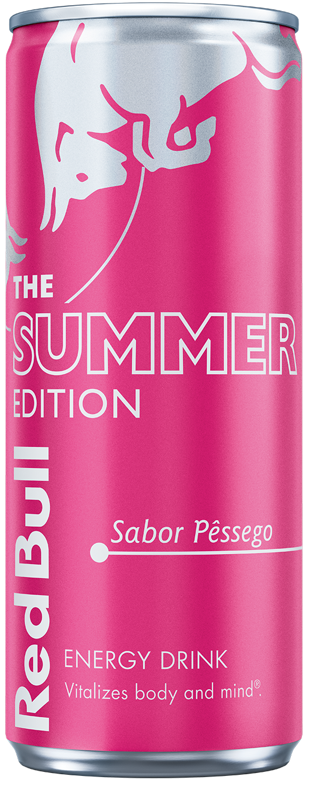

|Cor|Sabor|Provei|Lata|Imagem|Rank|País|
|---|-----|------|----|------|------|--|
| Red Bull|Default|✅|✅||S|Portugal & Espanha|
| Red Bull 355 ml|Default|✅|✅||S|Portugal & Espanha|
| Red Bull 473 ml|Default|✅|✅||S|Portugal & Espanha|
| Red Bull Green|Dragon Fruit|✅|✅||S|Espanha|
| Red Bull Red |Melância|✅|✅| |A|Portugal & Espanha|
| Red Bull Yellow |Frutos Tropicais|✅|✅| |A|Portugal|
| Red Bull Summer |Pêssego Branco|✅|✅| |A|Portugal & Espanha|
| Red Bull Orange |Alperce-Morango |✅|✅| |B|Portugal & Espanha|
| Red Bull Spring/Lilac |Toranja|✅|✅| |B|Espanha|
| Red Bull Summer/Green Lime |Lima e Melão|✅|✅| |C|Espanha|
| Red Bull Purple |Açaí|✅|✅||C|Portugal|
| Red Bull Sugar Free|Sem Açucar|✅|❌| |C|Portugal & Espanha|
| Red Bull Zero|N/A|✅|❌||D|Portugal & Espanha|
| Red Bull Coconut|Coco|❌|✅| |D|Portugal & Espanha|